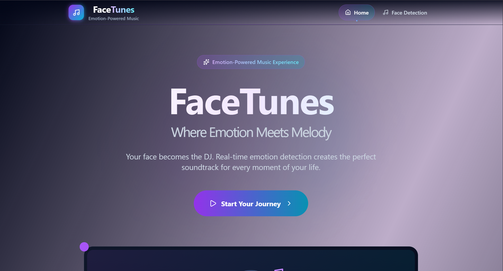
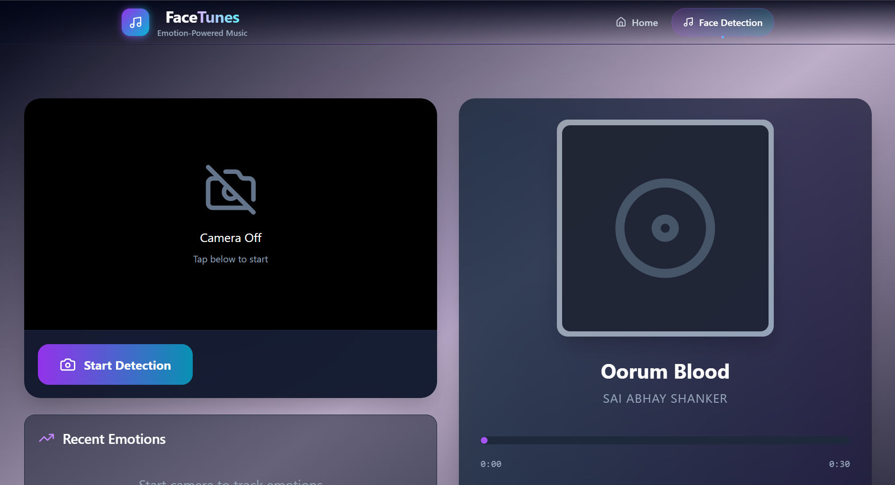
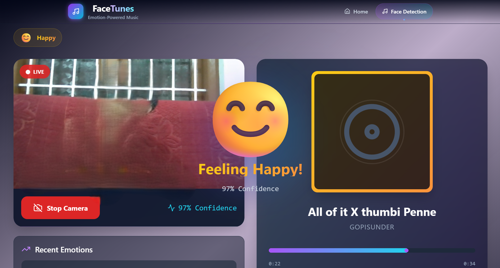
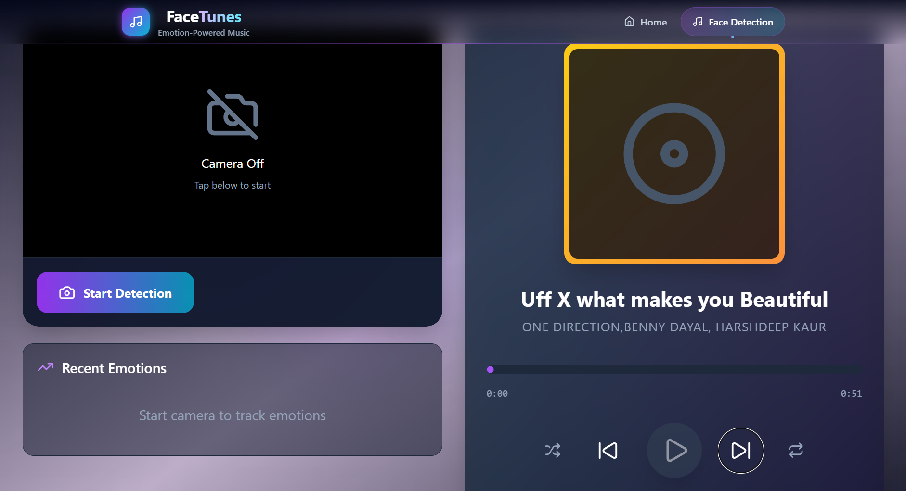

<div align="center">

# 🎵 FaceTunes

### _Where Emotion Meets Melody_

**Real-time AI-powered emotion detection meets intelligent music playback.**

[](https://react.dev)
[](https://vite.dev)
[](https://tailwindcss.com)
[](https://github.com/vladmandic/face-api)
[](https://www.framer.com/motion)
[](LICENSE)

[](https://facetuneshrx.netlify.app/)

<br>



</div>

---

## 📖 About

**FaceTunes** is a browser-based application that uses your webcam and TensorFlow.js-based facial recognition to detect your emotional state in real time, then automatically plays curated music tailored to your mood.

Your face becomes the DJ. No backend, no data uploads — **everything runs locally in your browser**.

---

## ✨ Features

- **Real-Time Face Detection** — Powered by `@vladmandic/face-api` with Tiny Face Detector
- **7 Emotion States** — Detects happy, sad, angry, neutral, surprised, fearful, and disgusted
- **Auto-Adaptive Playlists** — Curated tracks for each emotion, switching seamlessly as your mood changes
- **Immersive Emoji Overlay** — Full-screen animated emoji + confidence display every time your emotion shifts
- **Full Music Player** — Play / pause, skip, seek, volume control, shuffle, repeat, and playlist queue
- **Emotion History Log** — Timestamped log of detected emotions with confidence scores
- **Privacy First** — All detection runs client-side; no images or data are sent to any server
- **Responsive Dark UI** — Purple-cyan gradient theme built with Tailwind CSS and Framer Motion animations

---

## 🛠️ Tech Stack

| Category      | Technology                                                            |
| ------------- | --------------------------------------------------------------------- |
| **Frontend**  | [React 19](https://react.dev) + [Vite 7](https://vite.dev)            |
| **AI / ML**   | [face-api.js](https://github.com/vladmandic/face-api) + TensorFlow.js |
| **Styling**   | [Tailwind CSS 4](https://tailwindcss.com)                             |
| **Animation** | [Framer Motion 12](https://www.framer.com/motion)                     |
| **Icons**     | [Lucide React](https://lucide.dev)                                    |
| **Routing**   | [React Router 7](https://reactrouter.com)                             |
| **Charts**    | [Recharts](https://recharts.org)                                      |
| **Linting**   | ESLint + React Hooks Plugin                                           |

---

## 📸 Screenshots

```
📁 screenshots/
├── home.png            # Landing page with hero, features, CTA
├── detection.png       # Live webcam with face bounding box & landmarks
├── emotion-overlay.png # Full-screen emoji display on emotion change
└── music-player.png    # Music player controls, playlist queue
```

> **Note:** Add your own screenshots inside the `screenshots/` folder and they will render here automatically.

### Home Page


### Live Emotion Detection



### Emotion Change Overlay



### Music Player



---

## 🚀 Getting Started

### Prerequisites

- [Node.js](https://nodejs.org) **v18+** (v20+ recommended)
- npm, yarn, or pnpm
- A webcam (built-in or external)
- Modern browser (Chrome, Edge, Firefox, Safari)

### Installation

```bash
# Clone the repository
git clone https://github.com/<harysri>/emotion_detecton.git
cd emotion_detecton

# Navigate to the client directory
cd client

# Install dependencies
npm install

# Start the development server
npm run dev
```

The app will be available at `http://localhost:5173`.

### Live Demo

Try the live demo at: https://facetuneshrx.netlify.app/

### Build for Production

```bash
npm run build
npm run preview   # Preview the production build locally
```

---

## 📁 Project Structure

```
facetunes/
│
├── client/                        # React + Vite frontend
│   ├── public/
│   │   ├── models/                # face-api.js model weights
│   │   │   ├── tiny_face_detector_model-weights_manifest.json
│   │   │   ├── face_expression_model-weights_manifest.json
│   │   │   ├── face_landmark_68_model-weights_manifest.json
│   │   │   ├── face_recognition_model-weights_manifest.json
│   │   │   └── age_gender_model-weights_manifest.json
│   │   └── audio/                 # Playlist audio files
│   │       ├── happy/
│   │       ├── sad/
│   │       ├── angry/
│   │       ├── neutral/
│   │       ├── emotion_surprise/
│   │       ├── fearful/
│   │       └── disgusted/
│   │
│   ├── src/
│   │   ├── Components/
│   │   │   ├── Navbar.jsx         # Navigation bar
│   │   │   └── Footer.jsx         # Page footer
│   │   │
│   │   ├── Pages/
│   │   │   ├── Home.jsx           # Landing page (hero, features, CTA)
│   │   │   └── EmotionDetection.jsx  # Core app (webcam + music player)
│   │   │
│   │   ├── App.jsx                # Router setup
│   │   ├── main.jsx               # Entry point
│   │   ├── index.css              # Tailwind base imports
│   │   └── ...
│   │
│   ├── package.json
│   ├── vite.config.js
│   ├── tailwind.config.js
│   ├── postcss.config.js
│   └── eslint.config.js
│
├── screenshots/                   # README screenshots (add your own)
├── README.md                      # You are here
└── LICENSE
```

---

## 🎮 Usage Guide

1. **Allow Camera Access** — When prompted, grant webcam permission for your browser.
2. **Wait for Model Loading** — The Tiny Face Detector and expression model weights load once on first visit.
3. **Click "Start Detection"** — The camera feed activates and face-api.js begins real-time analysis.
4. **Watch Your Emotion** — A green bounding box with facial landmarks appears. Detected emotion displays as a pill badge.
5. **Enjoy the Music** — Curated tracks auto-play based on your detected mood. The music player gives you full control.
6. **See Emotion History** — Recent detections appear in a scrollable log with timestamps and confidence.

> **Tip:** For best results, ensure good lighting and face the camera directly.

---

## 🧠 How It Works

```
┌─────────────────┐     ┌──────────────────┐     ┌────────────────────┐
│   Face Detection│ ──▶ │  Emotion Analysis │ ──▶ │ Personalized Music │
│ (TinyFaceDetector) │   │ (Expression Net)  │     │  (Per-emotion      │
│  Bounding box +  │     │  happy/sad/angry  │     │   playlists)       │
│  landmarks       │     │  neutral/surprise │     │  Auto-switching    │
└─────────────────┘     └──────────────────┘     └────────────────────┘
```

Every 100ms the app:

1. Captures a frame from the webcam
2. Runs Tiny Face Detector + Face Landmarks + Expression Net
3. Picks the dominant emotion (confidence > 50%)
4. Switches the playlist if the emotion changed
5. Draws detection boxes and landmarks on a `<canvas>` overlay

---

## ☁️ Deployment

The app is a fully static client-side SPA — deploy anywhere that serves static files.

### Quick Deploy

| Platform             | Instructions                                                                     |
| -------------------- | -------------------------------------------------------------------------------- |
| **Vercel**           | `npm i -g vercel && vercel --prod`                                               |
| **Netlify**          | Connect repo → Publish directory: `client/dist` → Build command: `npm run build` |
| **Cloudflare Pages** | Framework preset: Vite → Build command: `npm run build` → Output: `dist`         |
| **GitHub Pages**     | Set `vite.config.js` `base` to `/<repo>/` → `npm run build` → deploy `dist/`     |

---

## 🔮 Future Improvements

- [ ] Audio visualizer (frequency bars synced to playback)
- [ ] Emotion history charts over time (Recharts integration)
- [ ] Export emotion timeline as CSV / image
- [ ] More extensive playlists per emotion
- [ ] User-customizable playlists (drag & drop tracks)
- [ ] Voice command controls
- [ ] PWA support (offline-ready)
- [ ] Dark / light theme toggle
- [ ] Multi-face detection support

---

## 🤝 Contributing

Contributions are welcome! Follow these steps:

1. **Fork** the repository
2. **Create your feature branch** — `git checkout -b feature/amazing-feature`
3. **Commit your changes** — `git commit -m "Add amazing feature"`
4. **Push to the branch** — `git push origin feature/amazing-feature`
5. **Open a Pull Request**

Please ensure your code passes the linter before submitting:

```bash
npm run lint
```

---

## 📄 License

Distributed under the **MIT License**. See `LICENSE` for more information.

---

## 👤 Author

**Your Name** — [@harysri](https://github.com/harysri)

Project Link: [https://github.com/harysri/emotion_detecton](https://github.com/harysri/emotion_detection)

---

## 🙏 Acknowledgements

- [@vladmandic](https://github.com/vladmandic) for the excellent [face-api](https://github.com/vladmandic/face-api) library
- [TensorFlow.js](https://www.tensorflow.org/js) team for bringing ML to the browser
- [Lucide](https://lucide.dev) for the beautiful open-source icons
- [Framer Motion](https://www.framer.com/motion) for buttery-smooth animations
- All the artists and composers whose music is featured in the demo playlists

---

<div align="center">

**Made with ❤️ and TensorFlow.js**

</div>
